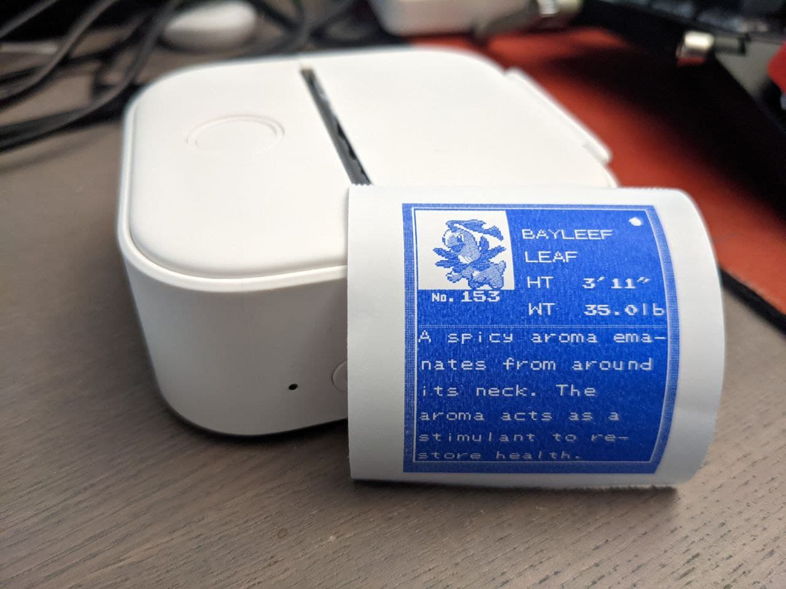

# ESP32 + Phomemo T02 Game Boy Printer

This project lets you print Game Boy Printer images via Bluetooth using a [Phomemo T02 thermal printer][7]
and an [ESP32][1] module to bridge the two. I used the DOIT DEVIT V1 ESP32-WROOM-32 board.

Note that this project is currently very bare bones. I'm hoping to make it a bit more beginner friendly soon, but for now I'm going to assume you have a bit of experience with microcontrollers and whatnot.

Also note that I don't have much real-world experience with C++ (especially on embedded systems) beyond some small scale Arduino projects, so the code is bound to be horrible and do some Very Bad Things.

## Getting started

1. Install [`platformio`](https://docs.platformio.org/en/latest/core/installation.html)
2. Clone this repository
4. Connect the Game Boy to the ESP32 using a level shifter
     - The Game Boy is a 5V device, but the ESP32 is 3.3V. It _might_ work without the level shifter, but you might also end up frying your ESP32!
5. Turn on the T02 and make sure nothing else is connected to it
3. Connect your ESP32 board and run `pio run -t upload`
6. Print!

## How to Connect
Consult the [Game Boy Link pin-out](http://www.hardwarebook.info/Game_Boy_Link) or [this insidegadgets page](https://www.insidegadgets.com/2018/12/09/making-the-gameboy-link-cable-wireless-packet-based/)
 to understand what each pin does. Connect SO (Serial Out) to GPIO 19, SI (Serial In) to GPIO 23 and SC (Clock) to GPIO 18. If you are not using
bi-directional level shifters, make sure that for SO and SC the signal
direction is from the Game Boy (GB) to the ESP and for SI it is from ESP to
the GB. You will also have to connect GND on both ends and both VDDs to the
respective reference voltage inputs.  

If you want to change the PIN assignments, you can do so in [`GBPrinter.cpp`](lib/GBPrinter/GBPrinter.cpp). 

*N.B.* Do not try to power the ESP from the Game Boy. Most ESP32 modules out
there use inefficient linear regulators and can pull more than 500mA of
current.

## Usage

Once the ESP has received a complete image from the GB, it will print it on the T02. 
If nothing happens, I suggest you use `pio run -t monitor` to see if the ESP32 is complaining about something.

## Limitations and Quirks

The Phomemo T02 is a black-and-white printer, whereas the original Game Boy Printer was able to print in four shades of grey, so this project applies some basic Bayer dithering to render the two greys. This might look terrible depending on what you're printing.

The GB Printer emulation code is based on [tidklaas/esp32-gameboy-printer](https://github.com/tidklaas/esp32-gameboy-printer), so the same notes apply.
I only tested this with Pokémon Silver on a Game Boy Color.

> The compressed image transfer format is not supported at all. Without a way of
testing there was no point in implementing it.
> 
> Since the whole protocol is bit-banged, it is susceptible to delays caused by other
higher priority tasks running on the ESP. This means mostly the [Bluetooth] task[...].
> 
> Error detection has been designed to err on the side of caution, so the ESP might
signal a transfer error to the GB, even though the image has been transferred and
saved correctly. This was deemed preferable to silently losing data.

Note that the Game Boy might give an error but then print normally. I'm not sure if Pokémon Silver has a particularly lenient GB Printer routine or if this is standard with all games.

## Acknowledgments
* The printer emulation code is basically verbatim from [tidklaas/esp32-gameboy-printer](https://github.com/tidklaas/esp32-gameboy-printer)
* The protocol to talk to the T02 was reverse engineered by `vivier` for the [vivier/phomemo-tools](https://github.com/vivier/phomemo-tools) project.

[1]: https://espressif.com/en/products/hardware/esp32/overview
[2]: https://github.com/espressif/esp-idf
[7]: https://www.indiegogo.com/projects/phomemo-t02-inkless-pocket-printer-for-creators#/